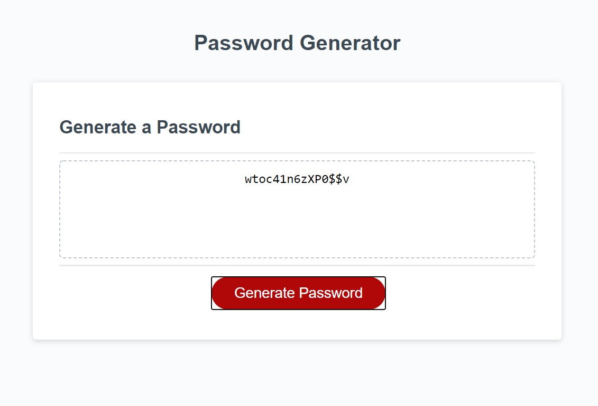

**My Password Generator:**

Ever needed a new password? Well luckily this generator
allows you to customize your random password any way you like!
You can have numbers, uppercase letters, lowercase letters, and even symbols!
Fear no more about having to come up with a random password, we have one for you.

**How it works:**

Just click the generate password button. You will then be asked to fill in
how many characters you would like. We already have you covered to make sure at least 8 
characters are being used to make yourself secure. Once you choose your password
length, you can then decide what kind of characters you want to have in the password.
This generator is made to make sure at least 1 of every option you select will be included
in the password generated. 

**Screeenshot:**

**Link to the website repository**

https://github.com/1b1d1/Homework-3

**Link to the deployed website:

https://1b1d1.github.io/Homework-3/
